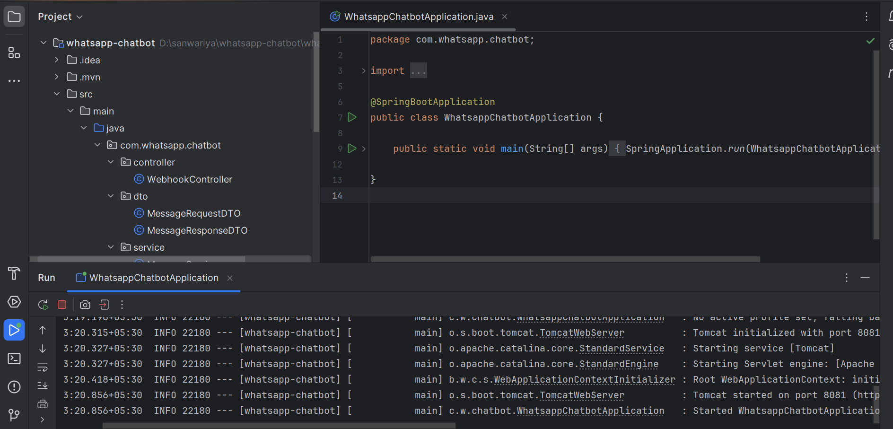
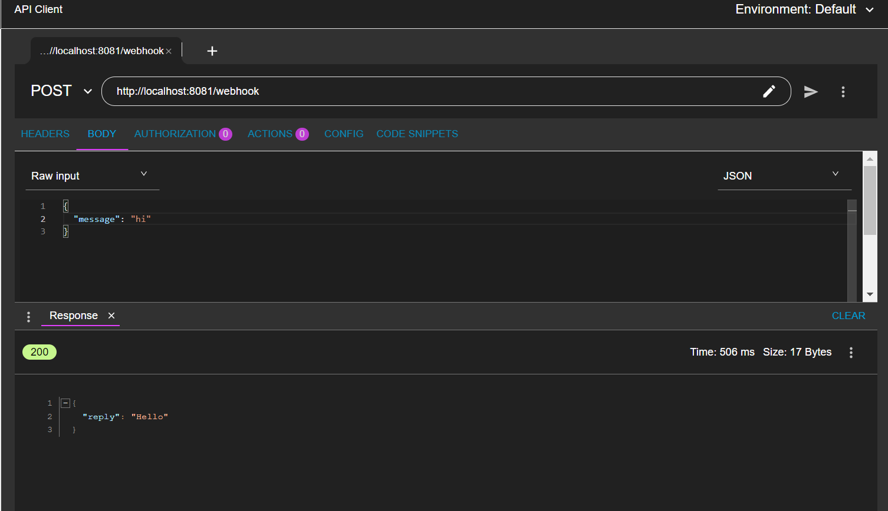
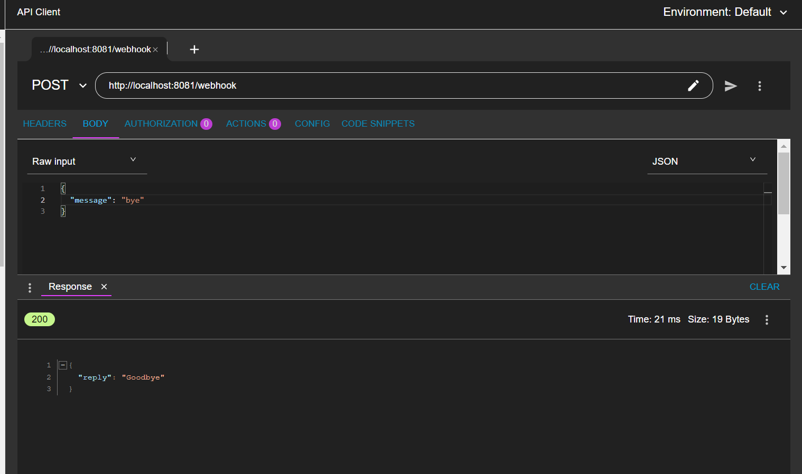
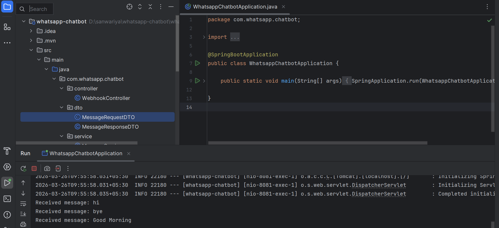
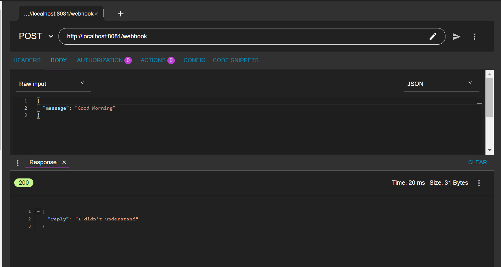

# WhatsApp Chatbot Backend Simulation

##  Project Description

This project is a simple WhatsApp chatbot backend simulation built using Java and Spring Boot.
It mimics how a WhatsApp webhook works by receiving messages via a REST API and responding with predefined replies.

## Features

- REST API webhook simulation
- Layered architecture (Controller, Service, DTO)
- Predefined chatbot responses
- Console logging of all incoming messages

##  How to Run

1. Clone the repository:
2. Open the project in IntelliJ IDEA
3. Run the main class:
4. The application will start on: http://localhost:8081

## 🌐 API Endpoint

**POST** `/webhook`
URL: http://localhost:8081/webhook

##  Sample Request
json
{
  "message": "Hi"
}

## Sample Response
{
  "reply": "Hello"
}

# Example Responses
Input ->   Output
Hi	  ->   Hello
Bye	  ->   Goodbye
Other ->   I didn't understand

## Logging

All incoming messages are logged in the console.
Example:
Received message: Hi

## Screenshots

1. Application Running

2. Postman Test - Hi

3. Postman Test - Bye

4. Console Logging

5. Unknown Message Response

#  Tech Stack
Java
Spring Boot
REST API